# Phase 0 — Substrate & Schema

> **Reading time:** ~20 minutes · **Hands-on time:** ~an evening
> **Goal of this phase:** build the *empty skeleton* and the *rulebook*. No automation, no real content yet — just a folder layout and a precise set of rules the agent will obey forever after.

---

## 0. How to read this doc

This is a **teaching doc**, not a spec. I explain *why* before *what*, in plain words, with diagrams. Read it top to bottom once. You don't need to memorize anything — when you give me the heads-up, I'll turn all of this into real files. Your job here is just to *understand the shape* of what we're building so that when you review the code, it feels familiar.

By the end you should be able to answer three questions in your own words:

1. What are the three "layers" and who is allowed to touch each one?
2. What is the "schema" and why is it the most important file in the whole project?
3. What happens, step by step, when we "ingest" one file of source code?

---

## 1. The one-paragraph mental model

We are building a **wiki that an AI agent owns and maintains**, describing a **codebase**. You feed it source code (the *sources*). The agent reads that code and writes human-readable markdown pages explaining the architecture (the *wiki*). It follows a rulebook you wrote (the *schema*) that tells it exactly how to write, link, and cite those pages. Over time the wiki becomes a living, cross-linked explanation of the codebase that's faster and more trustworthy to read than the code itself.

Think of it like this: a new senior engineer joins your team. Instead of re-reading the whole codebase every time someone asks a question, they keep a personal, ever-improving set of architecture notes — and every note says "I learned this from `auth/session.py:40-72`." That notebook is the wiki. The discipline they follow when writing notes is the schema.

---

## 2. The three layers

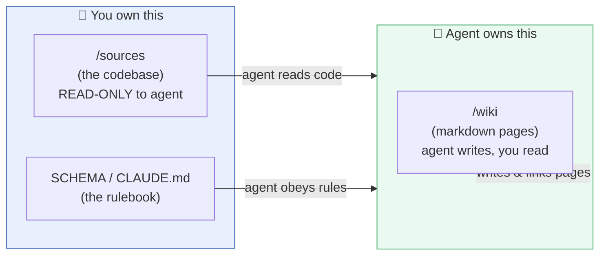

The single most important idea in the whole project is **who is allowed to edit what**:

| Layer | What it is | Who edits it | Who reads it |
|---|---|---|---|
| **Sources** | The codebase we're documenting — `.py`, `.ts`, `.go`, configs, etc. | **You** (it's just the repo). The agent **never** edits it. | Agent |
| **Wiki** | A folder of markdown pages explaining the code. | **The agent**, only. | You |
| **Schema** | The rulebook telling the agent how to build the wiki. | **You**, only. | Agent (every session) |

> ⚠️ **The golden rule of this whole project:** *Don't hand-edit wiki pages.* When a page is wrong, the temptation is to "just fix it." Resist. The wrongness is a signal that a **rule** is missing or unclear. Fix the *schema* and re-run. If you patch pages by hand, you'll never learn whether the agent can maintain the wiki on its own — which is the entire point of the exercise.

---

## 3. The three operations

Everything the agent ever does falls into one of three verbs. We're not building any of them in Phase 0 — we're just *defining* them in the rulebook so they're ready for Phase 1.

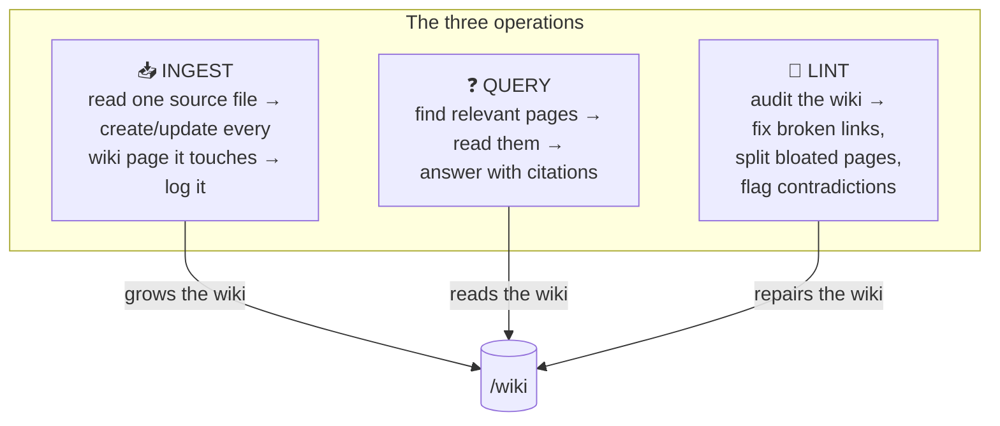

- **Ingest** = *learning*. One source file goes in; potentially many wiki pages get created or updated. A single new file can ripple through 10+ pages.
- **Query** = *recall*. A question goes in; a cited answer comes out, synthesized from existing pages (never hallucinated).
- **Lint** = *gardening*. Runs periodically to stop the wiki from rotting — broken links, duplicate pages, pages that grew to cover two topics, contradictions.

> **Why this beats plain RAG:** RAG re-reads raw code chunks and re-thinks the answer *every single time you ask*. The wiki **pre-compiles** understanding into pages once, so knowledge **compounds** across sessions instead of being rebuilt from scratch each time. Phase 0 just lays the substrate that makes that compounding possible.

---

## 4. The folder layout

Here's the empty skeleton we'll create. Nothing here has content yet except the schema and templates.

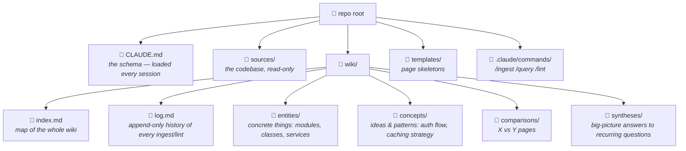

In a flat view:

```
repo/
├── CLAUDE.md               ← the schema (the heart of everything)
├── sources/                ← the codebase being documented (READ-ONLY to agent)
├── templates/              ← one skeleton file per page type
│   ├── entity.md
│   ├── concept.md
│   ├── comparison.md
│   └── synthesis.md
├── wiki/                   ← everything below is agent-owned
│   ├── index.md            ← the table of contents / map
│   ├── log.md              ← append-only journal of every operation
│   ├── entities/
│   ├── concepts/
│   ├── comparisons/
│   └── syntheses/
└── .claude/
    └── commands/           ← entry points the agent recognizes
        ├── ingest.md
        ├── query.md
        └── lint.md
```

> **Why folders by page type?** It keeps the wiki navigable by a human *and* makes lint rules easier ("every file in `entities/` must have a `## Responsibilities` section"). It also stops the agent from dumping 200 pages into one directory.

---

## 5. Page types — the vocabulary of the wiki

This is where the codebase framing really matters. For a code wiki, the four page types map cleanly onto how engineers actually think about a system.

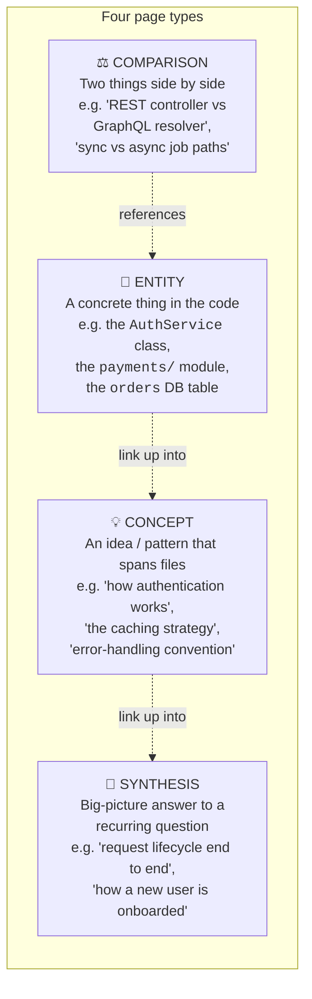

| Type | Answers the question… | Codebase examples | Folder |
|---|---|---|---|
| **Entity** | "What *is* this thing?" | A class, module, package, service, endpoint, DB table, config object | `entities/` |
| **Concept** | "How does this *work* across the code?" | Auth flow, caching, retry logic, the build pipeline, a design pattern in use | `concepts/` |
| **Comparison** | "How do these two differ?" | Two similar services, old vs new code path, two libraries doing similar jobs | `comparisons/` |
| **Synthesis** | "Give me the whole story." | End-to-end request lifecycle, "everything that happens on checkout" | `syntheses/` |

**The progression matters:** entities are the atoms, concepts group atoms into ideas, syntheses weave concepts into stories. The wiki gets *smarter* as pages climb this ladder — and that climb is exactly what plain RAG can never do.

---

## 6. The schema — the heart of the whole thing

> If you only deeply understand **one** part of this doc, make it this section. The roadmap says it bluntly: **"The schema is the real product."** Most of your iteration time across all phases will be spent sharpening this file. When the agent does something dumb, the fix is almost always a sharper rule here — *not* a hand-edit to a page.

The schema lives in **`CLAUDE.md`** so that Claude Code loads it automatically on **every** session. The agent reads it before doing anything, so its behavior is governed by your rules without you re-explaining them each time.

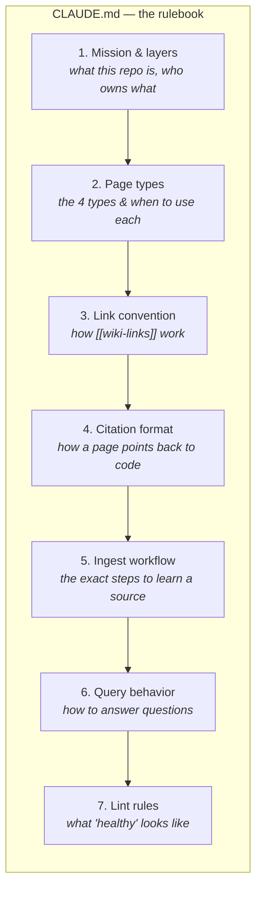

Let me unpack the parts that need explaining. (I'll write the full text when we implement; here I'm teaching you what each part *does*.)

### 6a. The `[[wiki-link]]` convention

Pages refer to each other with double brackets, like Obsidian or a wiki: `[[AuthService]]` or `[[authentication-flow]]`. This is what turns a pile of pages into a **graph**.

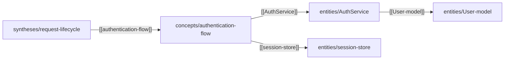

Rules we'll specify: links use the page's canonical name (its filename without `.md`); a page may have `aliases` so `[[auth service]]` and `[[AuthService]]` resolve to the same page; every link must point at a page that exists (lint enforces this later).

### 6b. The citation format — *the most codebase-specific rule*

Every claim in a wiki page must be **traceable back to the exact code that justifies it.** This is what makes the wiki trustworthy instead of a pile of confident-sounding guesses. For a codebase, a citation points at a **file and line range**:

> The session token is refreshed on every authenticated request. `[src: auth/session.py:40-72]`

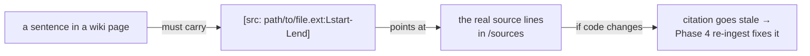

Why line ranges and not just filenames? Because in Phase 4 the killer feature is **incremental sync via `git diff`** — when a file changes, we want to know *which pages* depended on *which lines* so we re-ingest only what's affected. Precise citations today make that automation possible later.

### 6c. The ingest workflow (defined now, run in Phase 1)

This is the step-by-step recipe the agent follows when it reads one source file. We *write it down* in Phase 0; we *exercise it* in Phase 1.

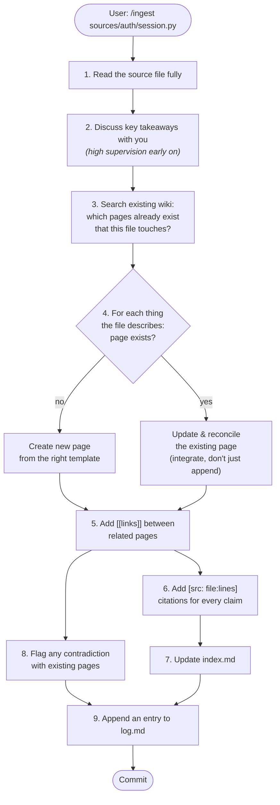

The two steps to burn into your memory are **#4 (update *or* create)** and **the difference between *appending* and *integrating*.** A weak wiki just tacks new facts onto the bottom of a page. A strong wiki *reconciles*: it rewrites the page so the new knowledge is woven in, contradictions are surfaced, and the page still reads as one coherent explanation. Learning to feel that difference is the headline lesson of Phase 1 — but the *rule that demands it* is written here in Phase 0.

### 6d. Query behavior (defined now, run in Phase 1)

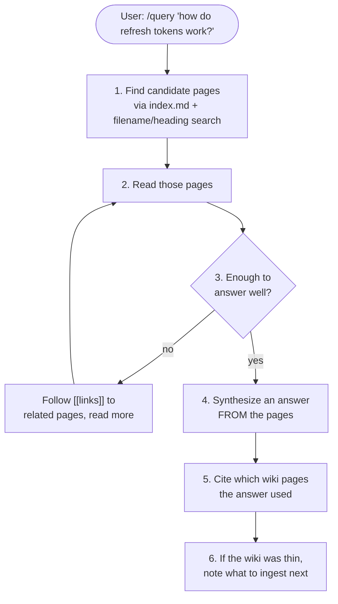

The rule that matters: **answers are synthesized from cited pages, never invented.** If the wiki can't support an answer, the agent says so and tells you what's missing — that gap is a to-do list for what to ingest next.

### 6e. Lint rules (defined now, run in Phase 1+)

Lint is the agent auditing its own wiki against a checklist of what "healthy" looks like:

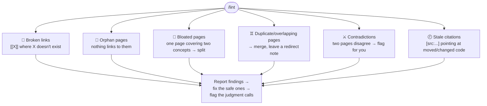

---

## 7. Page templates

Every page starts from a skeleton so structure stays consistent. Two parts: **frontmatter** (machine-readable metadata at the top) and a **body** (the human-readable explanation, with a fixed set of sections per type).

The frontmatter is shared by all page types:

```yaml
---
title: AuthService
type: entity            # entity | concept | comparison | synthesis
aliases: [auth service, authentication service]
sources: [auth/session.py, auth/middleware.py]   # which source files this page draws on
last_updated: 2026-06-28
---
```

And here's what an **entity** page body looks like (worked example), so the abstract becomes concrete:

```markdown
---
title: AuthService
type: entity
aliases: [auth service]
sources: [auth/session.py, auth/middleware.py]
last_updated: 2026-06-28
---

# AuthService

## What it is
The central service that issues, validates, and refreshes user
session tokens. `[src: auth/session.py:12-30]`

## Responsibilities
- Issue a session token on successful login `[src: auth/session.py:40-58]`
- Refresh the token on every authenticated request `[src: auth/session.py:60-72]`
- Reject expired or tampered tokens `[src: auth/middleware.py:22-45]`

## Key collaborators
- Reads/writes the [[session-store]]
- Wraps the [[User-model]]
- Invoked by [[auth-middleware]]

## Gotchas / notes
- Refresh is silent; the client never sees the rotation. `[src: auth/session.py:66]`

## Related
- Concept: [[authentication-flow]]
- Synthesis: [[request-lifecycle]]
```

Notice three things in that example:
1. **Every factual sentence carries a `[src: …]` citation.**
2. **It links outward** with `[[…]]` to collaborators and parent concepts — that's the graph forming.
3. **The sections are fixed** (`What it is`, `Responsibilities`, `Key collaborators`, `Gotchas`, `Related`) so lint can check completeness and so every entity page reads the same way.

Concept, comparison, and synthesis pages each get their own fixed section set (I'll define all four when we implement).

---

## 8. Entry points — the three slash commands

In Claude Code, `/ingest`, `/query`, and `/lint` are just markdown files in `.claude/commands/`. Each one is a short prompt that says "do *this* operation, following the workflow in `CLAUDE.md`." They're thin — the real intelligence lives in the schema. They exist so you can drive the whole system with three tidy commands instead of re-typing instructions.

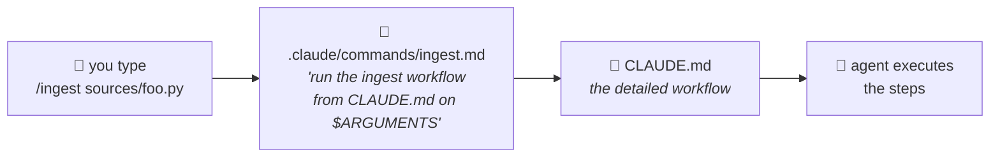

---

## 9. What we'll actually create in Phase 0 (the checklist)

When you give the heads-up, here's exactly what I'll produce — all skeleton, **no real content yet**:

- [ ] Initialize a **git repo** (everything is git — every ingest/lint becomes a diff-able, reversible commit).
- [ ] Create the **folder layout** from §4 (`sources/`, `wiki/` + subfolders, `templates/`, `.claude/commands/`).
- [ ] Write **`CLAUDE.md`** — the full schema: mission & layers, the 4 page types, the `[[link]]` convention, the `[src: file:lines]` citation format, the ingest workflow, query behavior, and lint rules.
- [ ] Write the **4 page templates** with frontmatter + fixed body sections.
- [ ] Create an empty **`wiki/index.md`** and **`wiki/log.md`** with their headers.
- [ ] Write the **3 slash commands** (`/ingest`, `/query`, `/lint`).
- [ ] *(Optional)* a short top-level `README.md` explaining the repo to a human visitor.

> We will **not** add any source code or write any wiki pages in Phase 0. That's Phase 1. Phase 0 is done when the repo is *fully specified but empty of content*, and the agent reads your schema on every session.

---

## 10. What you'll learn from this phase

- That the "system" is mostly **a folder layout plus a precise rulebook** — there's almost no code yet, and that's the point.
- **How much the schema's precision determines the agent's behavior.** Vague rule → sloppy wiki. Sharp rule → disciplined wiki. You'll feel this immediately in Phase 1.
- The vocabulary you'll use for the rest of the project: sources vs wiki vs schema; entity vs concept vs comparison vs synthesis; ingest vs query vs lint; append vs integrate.

---

## 11. Open question to settle before/at Phase 1

We deferred **which codebase** becomes our `sources/`. It doesn't block Phase 0 (we build the empty skeleton regardless), but by Phase 1 we need to pick the 3–5 source files to ingest first. Have a repo in mind? A small-to-medium one you know well is ideal, because — exactly like the trading-domain reasoning in the roadmap — you'll *instantly* spot when a wiki page is wrong, and that instinct is what trains good lint rules.

---

### ✅ Next step

Read this through. When you're ready, just say **"implement Phase 0"** and I'll create the repo skeleton, the schema, the templates, and the slash commands exactly as described above. Ask me anything that's unclear first — sharpening your understanding now pays off in every later phase.
